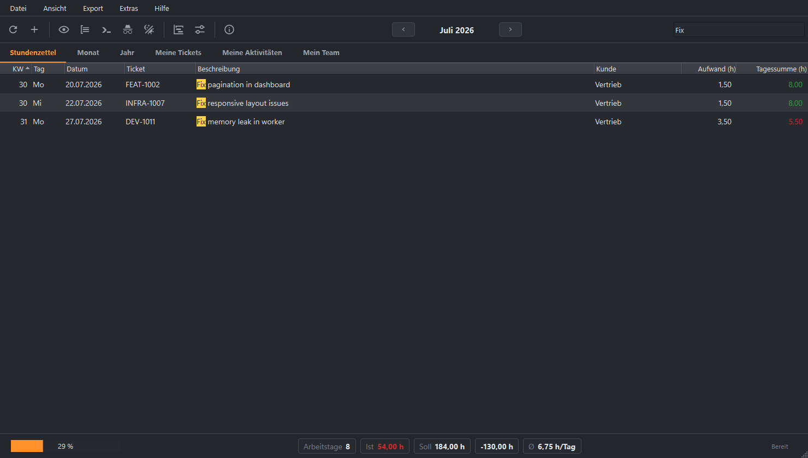
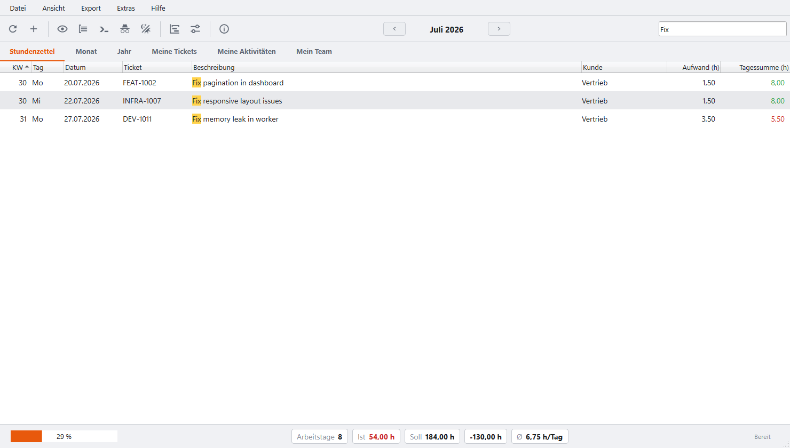
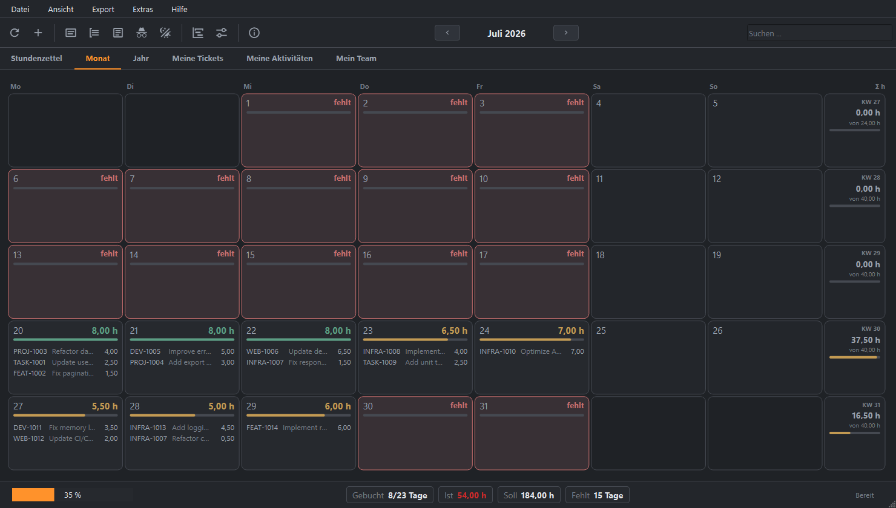
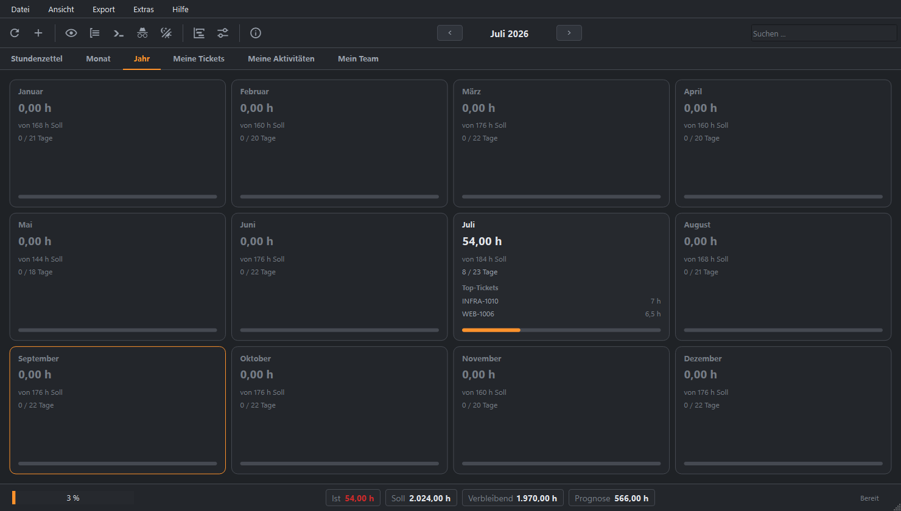
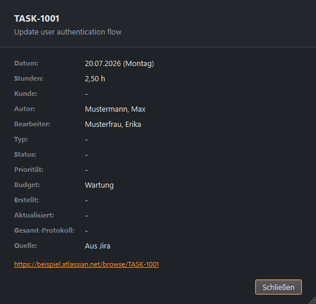
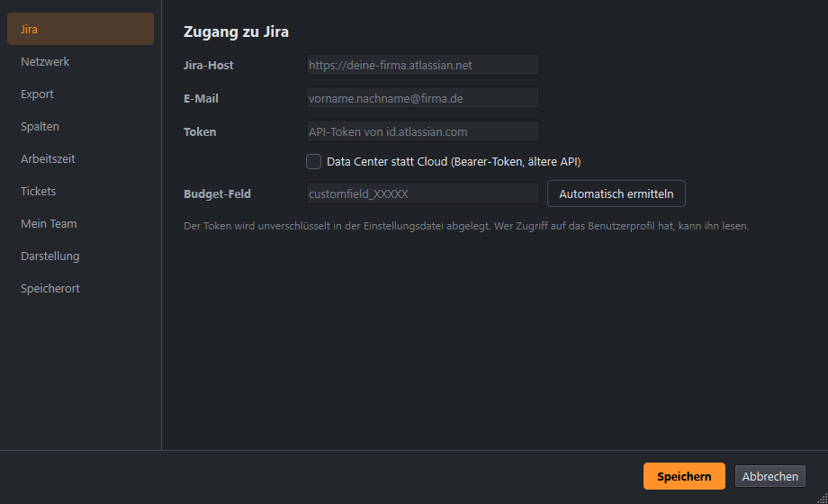

# jira-timesheet-qt

<p align="center">
   <a href="README.md">English</a> ·
   <b>Deutsch</b>
</p>

---

[](https://github.com/michaelblaess/jira-timesheet-qt/stargazers)
[](https://github.com/michaelblaess/jira-timesheet-qt/issues)
[](https://github.com/michaelblaess/jira-timesheet-qt/commits/main)
[](LICENSE)
[](https://www.python.org/)
[](https://doc.qt.io/qtforpython/)

Eine native Desktop-Anwendung (PySide6 / Qt 6) für Stundenzettel aus Jira-Worklogs - inklusive manueller Nacherfassung für Zeiten, die nicht in Jira gebucht sind.

<p align="center">
  
</p>

> **Haftungshinweis:** Dieses Projekt ist **nicht** von Atlassian entwickelt, unterstützt oder autorisiert. "Jira" und "Atlassian" sind eingetragene Markenzeichen von [Atlassian Corporation](https://www.atlassian.com/). Dieses Werkzeug nutzt die öffentliche Jira-REST-API und steht in keiner Verbindung zu Atlassian.

## TUI oder GUI?

Das ist der native Desktop-Port für die Textual-TUI
[jira-timesheet](https://github.com/michaelblaess/jira-timesheet). Beide bauen auf **demselben
Code** auf - dieselbe Jira-Anbindung, dieselbe Stundenzettel-Logik, manuelle Zeiterfassung,
Feiertagskalender und Excel-/PDF-Export - und liefern deshalb identische Ergebnisse. Beide
laufen unter **Windows, macOS und Linux**. Sie unterscheiden sich nur darin, wie Du mit ihnen
arbeitest, und jede hat echte Stärken:

- **[Terminal (TUI)](https://github.com/michaelblaess/jira-timesheet)** - läuft in jedem
  Terminal, **auch über SSH**, und braucht **keinen Window-Manager**. Das macht sie zur
  natürlichen Wahl auf einem entfernten Rechner oder einem Linux-Server ohne Oberfläche, wo
  ein Desktop schlicht nicht da ist. Tastaturzentriert, leichtgewichtig, mit Retro-Themes -
  und sie kann alles, was diese GUI kann.
- **Desktop (diese Anwendung)** - native Fenster, Menüs und Dialoge, durchgehend mit der Maus
  bedienbar, Spalten per Maus ziehbar, betriebssystemeigene Datei- und Druckdialoge. Die
  komfortable Wahl, wenn Du am Desktop sitzt und ein Fenster-Programm bevorzugst.

Keine ersetzt die andere - nimm die, die zu Deiner Umgebung oder Deinen Vorlieben passt, oder
beide. Sie legen ihre Daten getrennt ab und laufen problemlos nebeneinander.

## Screenshots

Die Anwendung folgt dem hellen oder dunklen Erscheinungsbild und einer einstellbaren Akzentfarbe.

### Listenansicht - sortierbar, durchsuchbar, mit Tagesgruppen

<p align="center">
  
  
</p>

### Live-Suche - Filter nach Ticket oder Beschreibung, Treffer hervorgehoben

<p align="center">
  
  
</p>

### Kalender- und Jahresansicht

<p align="center">
  
  
</p>

### Ticket-Details

<p align="center">
  
</p>

### Einstellungen - Jira-Zugang mit Budget-Feld-Autoerkennung

<p align="center">
  
</p>

## Funktionen

- **Jira Cloud &amp; Data Center** - Worklogs über die REST-API; standardmäßig Jira Cloud (v3,
  Basic-Auth mit API-Token), per Schalter auch altes Jira Server/Data Center (v2, Bearer-Token)
- **Budget-Feld automatisch ermitteln** - Bei Jira Cloud findet ein Klick das Budget-Custom-Field
  automatisch (kein manuelles Nachschlagen der Field-ID)
- **Listenansicht** - Tabellarisch mit Kalenderwoche, Wochentag, Tagesgruppen und Soll-/Ist-Stunden;
  die Tagessummen sind über Soll grün und unter Soll rot eingefärbt
- **Live-Suche / Filter** - Filtert beim Tippen nach Ticket-ID oder Beschreibung (`Strg+F`);
  Treffer werden in der Liste hervorgehoben
- **Verstellbare Spalten** - Zieh den Trenner im Spaltenkopf, die Breiten bleiben erhalten;
  ansonsten füllt die Beschreibungsspalte automatisch den restlichen Platz
- **Manuelle Zeiterfassung** - Erfasse Zeiten, die nicht in Jira gebucht sind, über einen Dialog
  (`Strg+N`), bearbeite sie direkt in der Tabelle oder über das Kontextmenü; abgelegt in SQLite,
  farblich markiert in Liste, Excel und PDF
- **Konfigurierbare Export-Spalten** - Jede Spalte lässt sich getrennt für Anzeige und Export
  schalten und im Export frei benennen (Einstellungsseite "Spalten"), inklusive Kunden-Spalte
- **Kalenderansicht** - Monatsgrid mit farbcodierten Tageskacheln; anklickbare Ticket-Links
  öffnen den Detail-Dialog
- **Jahresansicht** - Zwölf Monatskacheln mit Fortschrittsbalken, Prognose, Umsatz-Summen und
  den Top-Tickets je Monat; jedes Ticket ist ein Link zum Detail-Dialog
- **Excel-Export** - Formatierter Stundenzettel mit Logo und Unterschriftszeile
- **PDF-Export** - Adobe-signierbar, Unicode-Schrift
- **Druckvorschau** - Vorschau und Druck des Stundenzettels direkt aus der Anwendung (`Strg+P`)
- **Feiertage** - Deutsche Feiertage pro Bundesland, Lücken-Erkennung
- **Soll/Ist &amp; Prognose** - Arbeitszeitvergleich mit Differenz; Jahres-Prognose mit
  Urlaubstagen und einer Netto-/Brutto-Umsatzprognose (Stundensatz und MwSt einstellbar)
- **Ticket-Details** - Ein modaler Dialog zeigt Status, Typ, Bearbeiter, Komponenten und einen
  Link zum Ticket
- **Anonymisierung** - Ersetzt Tickets, Beschreibungen, Autoren und den Jira-Host durch
  Dummy-Werte für sichere Screenshots; die echten Daten bleiben unangetastet
- **Andockbares Log** - Ein anheftbares Meldungsfenster mit dem vollen Verlauf (`Strg+L`)
- **Zoom** - Skaliert die ganze Oberfläche mit `Strg` +/- / 0 oder `Strg` + Mausrad, wie im Browser
- **Worklog-Cache** - Abgeschlossene Monate werden gecacht, die Jahresansicht lädt sofort
- **Zweisprachige Oberfläche** - Deutsch / Englisch
- **Einstellungs-Backup** - Jedes Speichern legt eine rollierende Sicherung und eine goldene
  Kopie an; ein verlorener Jira-Zugang lässt sich beim nächsten Start wiederherstellen

## Installation

### Ein-Klick-Installation

**Windows (PowerShell):**
```powershell
irm https://raw.githubusercontent.com/michaelblaess/jira-timesheet-qt/main/install.ps1 | iex
```

**Linux / macOS:**
```bash
curl -fsSL https://raw.githubusercontent.com/michaelblaess/jira-timesheet-qt/main/install.sh | bash
```

### Download

Lieber als Datei? Hol Dir das aktuelle Archiv von der
[Releases](https://github.com/michaelblaess/jira-timesheet-qt/releases)-Seite, entpack es und
starte die Anwendung. Sie läuft unter **Windows, macOS und Linux**.

## Benutzung

```bash
jira-timesheet-qt              # Anwendung starten
jira-timesheet-qt --demo       # Start mit Beispieldaten, ohne Jira-Zugang
```

Beim ersten Start die Einstellungen öffnen (`Strg+,`) und den **Jira-Zugang** eintragen:

- **Jira-Host-URL** - Cloud: die kanonische `https://deine-firma.atlassian.net`
- **E-Mail / Login** - Cloud: Deine Atlassian-Login-Mail; Data Center: Dein Jira-Benutzername
- **Token** - Cloud: ein API-Token von
  [id.atlassian.com](https://id.atlassian.com/manage-profile/security/api-tokens);
  Data Center: ein Bearer-Token (PAT)
- **Jira-Modus** - für Jira Cloud aus lassen, für altes Server/Data Center einschalten
- **Budget-Feld** - bei Cloud mit **Automatisch ermitteln** das Custom-Field automatisch füllen
- **Bundesland** - für die Feiertagsberechnung

Dann `F5` drücken, um die Buchungen des gewählten Monats zu holen.

### Zeiten erfassen, die nicht in Jira stehen

Nicht jede Stunde landet als Worklog in Jira. `Strg+N` öffnet einen Dialog für Datum, Ticket,
Beschreibung, Kunde und Aufwand. Den Aufwand darfst Du so schreiben, wie Du ihn ohnehin
notierst: `3h 30m`, `3:30`, `3,5` oder `45m`.

Diese Einträge liegen in einer eigenen SQLite-Datei (`~/.jira-timesheet-qt/manual-entries.db`)
und **nie** im Jira-Cache. Sie zählen überall mit - Tagessumme, Monatssumme, Soll/Ist,
Kalender, Jahresansicht, Excel und PDF - und sind farblich markiert, damit auf einen Blick klar
ist, was aus Jira kommt und was nicht. Ein Rechtsklick auf eine Zeile öffnet ein Kontextmenü;
Beschreibung und Aufwand eines manuellen Eintrags lassen sich direkt in der Tabelle bearbeiten.

### Anonymisieren für Screenshots

*Ansicht -> Daten anonymisieren* (auch in der Toolbar) ersetzt Tickets, Beschreibungen, Autoren
und den Jira-Host in allen Ansichten und im Log durch neutrale Dummy-Werte. Deine echten Daten
bleiben im Cache und kehren zurück, sobald Du wieder umschaltest - praktisch für Screenshots
und Demos.

## Haftungshinweis beim ersten Start

Beim ersten Start erscheint ein Hinweis, der bestätigt werden muss - ohne Zustimmung beendet sich das Programm. Grund: Das Werkzeug liest über die Jira-REST-API Arbeitszeit-Buchungen aus einem fremden System. Welche Vorgänge und Worklogs dabei sichtbar werden, bestimmen allein die Berechtigungen des verwendeten Zugangs, und je nach Rechtevergabe gehören dazu auch Buchungen anderer Personen. Mit der Bestätigung erklärst Du, das Programm nur gegen dazu berechtigte Jira-Instanzen einzusetzen und nur Daten auszuwerten, zu deren Verarbeitung Du befugt bist.

Die Zustimmung wird in `~/.jira-timesheet-qt/disclaimer.json` festgehalten und nur erneut abgefragt, wenn sich der Wortlaut ändert. Den Speicherort zeigt der Reiter "Speicherort" im Einstellungsdialog - dort lässt sich die Datei auch löschen, um den Hinweis wieder anzuzeigen.

Die Software wird kostenlos und ohne jede Gewährleistung bereitgestellt ("as is"), wie in Abschnitt 7 der Apache License 2.0 geregelt. Die Haftung des Autors (Michael Blaess) für Schäden aus der Nutzung ist im gesetzlich zulässigen Rahmen ausgeschlossen. Die Haftung für Vorsatz und grobe Fahrlässigkeit, für die Verletzung von Leben, Körper oder Gesundheit sowie nach zwingendem Produkthaftungsrecht bleibt unberührt.

## Tastenkürzel

| Taste | Aktion |
| --- | --- |
| `F5` | Buchungen des Monats holen (bzw. das Jahr in der Jahresansicht) |
| `Strg+F` | Suchfeld fokussieren |
| `Strg+N` | Manuelle Zeit erfassen |
| `Strg+D` | Ticket-Details anzeigen |
| `Strg+E` | Excel-Export |
| `Strg+Umschalt+E` | PDF-Export |
| `Strg+P` | Druckvorschau |
| `Strg+L` | Meldungsfenster ein-/ausblenden |
| `Strg` +/- / 0 | Zoom rein / raus / zurücksetzen (auch `Strg` + Mausrad) |
| `Strg+,` | Einstellungen |
| `F1` | Info |
| `Strg+Q` | Beenden |

## Konfiguration

Die Einstellungen liegen in `~/.jira-timesheet-qt/settings.json`:

| Einstellung | Beschreibung | Standard |
| --- | --- | --- |
| Jira-Host | URL der Jira-Instanz (Cloud: `...atlassian.net`) | - |
| Token | API-Token (Cloud) oder Bearer-Token (Data Center) | - |
| E-Mail | Atlassian-Login (Cloud) oder Jira-Benutzername (Data Center) | - |
| Jira-Modus (Legacy-API) | Aus = Jira Cloud (v3), an = Data Center (v2) | aus |
| Budget-Custom-Field | Custom-Field-ID; Cloud unterstützt **Automatisch ermitteln** | customfield_... |
| Bundesland | Für die Feiertagsberechnung | SN |
| Soll-Stunden/Tag | Arbeitsstunden pro Tag | 8,0 |
| Max. Jahresstunden | Obergrenze für den Fortschrittsbalken | 1720 |
| Urlaubstage | Für die Jahresprognose | 30 |
| Stundensatz | Netto, für die Umsatzprognose | 0 (aus) |
| MwSt-Satz | Prozent, für die Brutto-Berechnung | 19 |
| Soll-Stunden im Export | Zeigt die Soll-Zeile in Excel/PDF | falsch |
| Ticket-Links im Export | Hyperlinks in Excel/PDF | falsch |
| Standard-Kunde | Kunde für alle aus Jira geholten Einträge | Vertrieb |
| Manuelle Einträge markieren | Färbt manuelle Zeiten in Liste, Excel und PDF | wahr |
| Tagessummen einfärben | Färbt Tagessummen nach Soll/Ist | wahr |
| Spalten | Je Spalte: Anzeige, Export und Bezeichnung | alle an |
| Theme / Akzent / Zoom | Erscheinungsbild | System / Orange / 100 % |
| Sprache | Oberflächensprache (de / en) | de |

## Verhältnis zur Textual-Fassung

Der Code (`models/`, `services/`, `i18n.py`) ist aus
[jira-timesheet](https://github.com/michaelblaess/jira-timesheet) **kopiert, nicht
eingebunden** - eine Änderung dort kommt hier nicht automatisch an. Das ist gewollt: Eine
Einbindung würde das gesamte TUI-Framework mitziehen. Damit die beiden Kerne nicht unbemerkt
auseinanderlaufen:

```bash
uv run poe core-sync      # vergleicht beide Kerne und meldet Abweichungen
```

Beide Anwendungen legen ihre Dateien getrennt ab (`~/.jira-timesheet-qt` bzw.
`~/.jira-timesheet`) und lassen sich parallel benutzen.

## Tech-Stack

- [Python](https://python.org) >= 3.12
- [PySide6](https://doc.qt.io/qtforpython/) - Qt-6-Bindings (LGPL)
- [qtawesome](https://github.com/spyder-ide/qtawesome) - Material-Design-Icons
- [httpx](https://www.python-httpx.org) - asynchroner HTTP-Client
- [openpyxl](https://openpyxl.readthedocs.io) - Excel-Export
- [fpdf2](https://py-pdf.github.io/fpdf2) - PDF-Export
- [holidays](https://python-holidays.readthedocs.io) - Feiertagsberechnung

## Entwicklung

Die Entwicklungsumgebung aufsetzen (das ist für Mitwirkende, nicht zum Installieren der App):

```bash
git clone https://github.com/michaelblaess/jira-timesheet-qt.git
cd jira-timesheet-qt
./bootstrap.ps1        # Dev-Umgebung mit uv einrichten (Linux/macOS: ./bootstrap.sh)
uv run poe run         # aus dem Quellcode starten
uv run poe test        # Testsuite
uv run poe lint        # ruff + mypy (strict)
```

## Lizenz

Apache License 2.0, siehe [LICENSE](LICENSE).

---

> **Markenhinweis:** "Jira" ist ein eingetragenes Markenzeichen der
> [Atlassian Corporation](https://www.atlassian.com/). Dieses Projekt steht in keiner
> Verbindung zu Atlassian, wird von Atlassian nicht unterstützt und nicht gesponsert.
