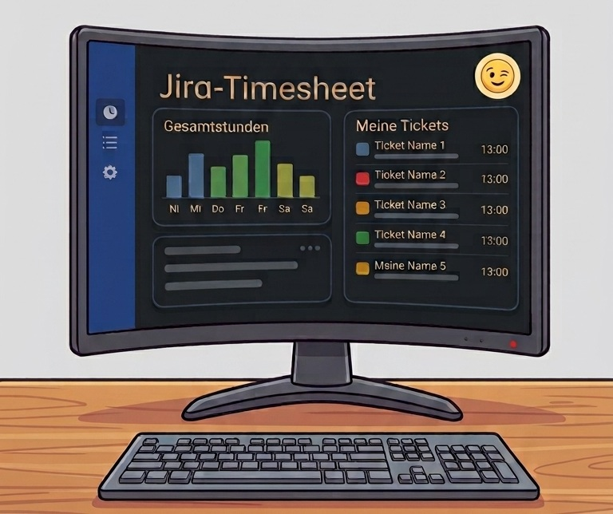

# jira-timesheet-qt

<p align="center">
   <b>English</b> ·
   <a href="README.de.md">Deutsch</a>
</p>

---

[](https://github.com/michaelblaess/jira-timesheet-qt/stargazers)
[](https://github.com/michaelblaess/jira-timesheet-qt/issues)
[](https://github.com/michaelblaess/jira-timesheet-qt/commits/main)
[](LICENSE)
[](https://www.python.org/)
[](https://doc.qt.io/qtforpython/)

A native desktop application (PySide6 / Qt 6) for timesheets from Jira worklogs - including manual time entry for hours that are not booked in Jira.

<p align="center">
  
</p>

> **Disclaimer:** This project is **not** developed, supported, or authorized by Atlassian. "Jira" and "Atlassian" are registered trademarks of [Atlassian Corporation](https://www.atlassian.com/). This tool uses the public Jira REST API and is not affiliated with Atlassian.

## TUI or GUI?

This is the native desktop port of the Textual TUI
[jira-timesheet](https://github.com/michaelblaess/jira-timesheet). Both are built on the
**same code** - the same Jira integration, timesheet logic, manual time tracking, holiday
calendar and Excel/PDF export - so they produce identical results. Both run on **Windows,
macOS and Linux**. They differ in how you work with them, and each has genuine strengths:

- **[Terminal (TUI)](https://github.com/michaelblaess/jira-timesheet)** - runs in any
  terminal, **including over SSH**, and needs **no window manager** at all. That makes it the
  natural choice on a remote box or a headless Linux server where a desktop simply is not there.
  Keyboard-first, lightweight, retro-themed, and it does everything this GUI does.
- **Desktop (this app)** - native windows, menus and dialogs, mouse-driven throughout,
  columns you drag to resize, OS-native file and print dialogs. The comfortable choice when
  you are sitting at a desktop and prefer a windowed application.

Neither replaces the other - pick the one that fits your environment or your taste, or use
both. They keep their data in separate locations and run happily side by side.

## Screenshots

The application follows the light or dark theme and a configurable accent colour.

### List view - sortable, searchable, with day groups

<p align="center">
  
  
</p>

### Live search - filter by ticket or description, matches highlighted

<p align="center">
  
  
</p>

### Calendar and year view

<p align="center">
  
  
</p>

### Ticket details

<p align="center">
  
</p>

### Settings - Jira access with budget-field auto-detect

<p align="center">
  
</p>

## Features

- **Jira Cloud &amp; Data Center** - Worklogs via REST API; Jira Cloud (v3, basic auth with
  API token) by default, with a toggle for legacy Jira Server/Data Center (v2, bearer token)
- **Budget field auto-detect** - On Jira Cloud, one click finds the budget custom field
  automatically (no manual ID lookup)
- **List view** - Tabular with calendar week, weekday, day groups and target/actual hours;
  day totals coloured green above and red below the target
- **Live search / filter** - Filter by ticket ID or description as you type (`Ctrl+F`);
  matches are highlighted in the list
- **Resizable columns** - Drag the divider in the column header, widths are persisted;
  otherwise the description column fills the remaining width automatically
- **Manual time tracking** - Record time that is not booked in Jira via a dialog (`Ctrl+N`),
  edit it inline or from the context menu; stored in SQLite, colour-marked in the list, Excel
  and PDF
- **Configurable export columns** - Every column can be toggled for display and export
  independently and renamed for the export (settings page "Columns"), including a customer column
- **Calendar view** - Monthly grid with colour-coded day tiles; clickable ticket links open
  the detail dialog
- **Year view** - Twelve month tiles with progress bar, forecast, revenue totals and the top
  tickets per month; every ticket is a link to its detail dialog
- **Excel export** - Formatted timesheet with logo and signature line
- **PDF export** - Adobe-signable, Unicode font
- **Print preview** - Preview and print the timesheet straight from the app (`Ctrl+P`)
- **Public holidays** - German public holidays per federal state, gap detection
- **Target/actual &amp; forecast** - Working-time comparison with difference; yearly forecast
  with vacation days and a net/gross revenue projection (configurable hourly rate and VAT)
- **Ticket details** - A modal dialog shows status, type, assignee, components and a link to
  the ticket
- **Anonymization** - Replace tickets, descriptions, authors and the Jira host with dummy
  values for safe screenshots; the real data stays untouched
- **Docked log** - An attachable message panel with the full history (`Ctrl+L`)
- **Zoom** - Scale the whole interface with `Ctrl` +/- / 0 or `Ctrl` + mouse wheel, like a browser
- **Worklog cache** - Completed months are cached, the year view loads instantly
- **Bilingual UI** - German / English
- **Settings backup** - Every save writes a rolling backup and a golden copy; a lost Jira
  access can be restored on the next start

## Installation

### One-click install

**Windows (PowerShell):**
```powershell
irm https://raw.githubusercontent.com/michaelblaess/jira-timesheet-qt/main/install.ps1 | iex
```

**Linux / macOS:**
```bash
curl -fsSL https://raw.githubusercontent.com/michaelblaess/jira-timesheet-qt/main/install.sh | bash
```

### Download

Prefer a file? Grab the latest archive from the
[Releases](https://github.com/michaelblaess/jira-timesheet-qt/releases) page, unpack it and
start the application. It runs on **Windows, macOS and Linux**.

## Usage

```bash
jira-timesheet-qt              # start the application
jira-timesheet-qt --demo       # start with example data, no Jira access required
```

On first start, open the settings (`Ctrl+,`) and configure the **Jira access**:

- **Jira host URL** - Cloud: the canonical `https://your-company.atlassian.net`
- **Email / login** - Cloud: your Atlassian login email; Data Center: your Jira username
- **Token** - Cloud: an API token from
  [id.atlassian.com](https://id.atlassian.com/manage-profile/security/api-tokens);
  Data Center: a bearer token (PAT)
- **Jira mode** - leave off for Jira Cloud, enable for a legacy Server/Data Center
- **Budget field** - on Cloud, use **Auto-detect** to fill in the custom field automatically
- **Federal state** - for the public-holiday calculation

Then press `F5` to fetch the bookings for the selected month.

### Recording time that is not in Jira

Not every hour ends up as a worklog in Jira. `Ctrl+N` opens a dialog for date, ticket,
description, customer and effort. The effort may be written the way you note it anyway:
`3h 30m`, `3:30`, `3.5` or `45m`.

These entries live in their own SQLite file (`~/.jira-timesheet-qt/manual-entries.db`) and
**never** in the Jira cache. They count everywhere - daily total, monthly total, target/actual,
calendar, year view, Excel and PDF - and are colour-marked so it is obvious what comes from
Jira and what does not. A right-click on a row opens a context menu; description and effort of
a manual entry can be edited directly in the table.

### Anonymizing for screenshots

*View → Anonymize data* (also on the toolbar) replaces tickets, descriptions, authors and the
Jira host with neutral dummy values across every view and the log. Your real data stays in the
cache and returns the moment you switch it off - handy for screenshots and demos.

## Liability notice on first start

On its first start the program shows a notice that has to be confirmed - without your consent it exits. The reason: this tool reads work log entries from a third-party system through the Jira REST API. Which issues and work logs become visible is determined solely by the permissions of the account you use, and depending on how rights are assigned these may include entries booked by other people. By confirming, you declare that you will only use the program against Jira instances you are authorised to access, and that you will only evaluate data you are permitted to process.

Your consent is recorded in `~/.jira-timesheet-qt/disclaimer.json` and is only requested again when the wording changes. The "Storage" tab of the settings dialog shows the location, where you can also delete the file to see the notice again.

The software is provided free of charge and without warranty of any kind ("as is"), as set out in section 7 of the Apache License 2.0. The liability of the author (Michael Blaess) for damages arising from its use is excluded to the extent permitted by applicable law. Liability for intent and gross negligence, for injury to life, body or health, and under mandatory product liability law remains unaffected.

## Keyboard Shortcuts

| Key | Action |
| --- | --- |
| `F5` | Fetch the bookings for the month (or the year in year view) |
| `Ctrl+F` | Focus the search field |
| `Ctrl+N` | Record manual time |
| `Ctrl+D` | Show ticket details |
| `Ctrl+E` | Excel export |
| `Ctrl+Shift+E` | PDF export |
| `Ctrl+P` | Print preview |
| `Ctrl+L` | Show / hide the log panel |
| `Ctrl` +/- / 0 | Zoom in / out / reset (also `Ctrl` + mouse wheel) |
| `Ctrl+,` | Settings |
| `F1` | Info |
| `Ctrl+Q` | Quit |

## Configuration

Settings are stored in `~/.jira-timesheet-qt/settings.json`:

| Setting | Description | Default |
| --- | --- | --- |
| Jira host | URL of the Jira instance (Cloud: `...atlassian.net`) | - |
| Token | API token (Cloud) or bearer token (Data Center) | - |
| Email | Atlassian login (Cloud) or Jira username (Data Center) | - |
| Jira mode (legacy API) | Off = Jira Cloud (v3), on = Data Center (v2) | off |
| Budget custom field | Custom field ID; Cloud supports **Auto-detect** | customfield_... |
| Federal state | For the public-holiday calculation | SN |
| Target hours/day | Working hours per day | 8.0 |
| Max. yearly hours | Upper limit for the progress bar | 1720 |
| Vacation days | For the yearly forecast | 30 |
| Hourly rate | Net, for the revenue projection | 0 (off) |
| VAT rate | Percent, for the gross calculation | 19 |
| Target hours in export | Shows the target row in Excel/PDF | false |
| Ticket links in export | Hyperlinks in Excel/PDF | false |
| Default customer | Customer for all entries fetched from Jira | Vertrieb |
| Highlight manual entries | Colours manual time in list, Excel and PDF | true |
| Day-total colouring | Colours daily totals by target/actual | true |
| Columns | Per column: display, export and label | all enabled |
| Theme / accent / zoom | Appearance | system / orange / 100 % |
| Language | UI language (de / en) | de |

## Relationship to the Textual version

The code (`models/`, `services/`, `i18n.py`) is **copied**, not imported, from
[jira-timesheet](https://github.com/michaelblaess/jira-timesheet) - a change there does not
arrive here automatically. That is deliberate: importing it would pull the whole TUI framework
into this app. To keep the two cores from drifting apart unnoticed:

```bash
uv run poe core-sync      # compares both cores and reports differences
```

Both applications keep their files in separate locations
(`~/.jira-timesheet-qt` vs. `~/.jira-timesheet`), so they can be used in parallel.

## Tech Stack

- [Python](https://python.org) >= 3.12
- [PySide6](https://doc.qt.io/qtforpython/) - Qt 6 bindings (LGPL)
- [qtawesome](https://github.com/spyder-ide/qtawesome) - Material Design icons
- [httpx](https://www.python-httpx.org) - async HTTP client
- [openpyxl](https://openpyxl.readthedocs.io) - Excel export
- [fpdf2](https://py-pdf.github.io/fpdf2) - PDF export
- [holidays](https://python-holidays.readthedocs.io) - public-holiday calculation

## Development

Setting up the development environment (this is for contributors, not for installing the app):

```bash
git clone https://github.com/michaelblaess/jira-timesheet-qt.git
cd jira-timesheet-qt
./bootstrap.ps1        # set up the dev environment with uv (Linux/macOS: ./bootstrap.sh)
uv run poe run         # run from source
uv run poe test        # run the test suite
uv run poe lint        # ruff + mypy (strict)
```

## License

Apache License 2.0, see [LICENSE](LICENSE).

---

> **Trademark Notice:** "Jira" is a registered trademark of
> [Atlassian Corporation](https://www.atlassian.com/). This project is not affiliated with,
> endorsed by, or sponsored by Atlassian.
