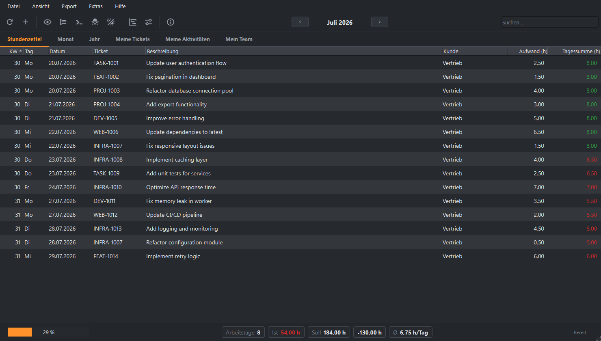
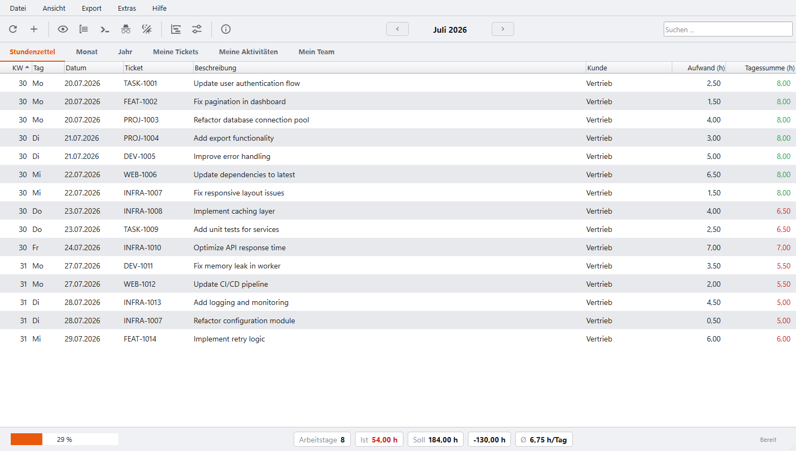

# jira-timesheet-qt

Desktop-GUI für Stundenzettel aus Jira-Worklogs, auf PySide6 (Qt 6).

> **Status:** Benutzbar. Zugang eintragen, Monat wählen, Buchungen holen,
> als Excel oder PDF ausgeben. Was noch fehlt, steht in [PLAN.md](PLAN.md).

<p align="center">
  
  
</p>

```bash
./run.ps1 --demo     # startet mit Beispieldaten, ohne Jira
```

## Was sie kann

| | |
| --- | --- |
| Liste | Buchungen des Monats, sortierbar, durchsuchbar, mit Detailbereich |
| Kalender | Monatsraster - Arbeitstage ohne Buchung sind hervorgehoben |
| Jahr | zwölf Monatskacheln mit Summen und Auslastung |
| Export | Excel und PDF, dazu eine Druckvorschau |
| Meldungen | andockbares Fenster mit dem Verlauf (Strg+L) |

### Tastenkürzel

| Taste | |
| --- | --- |
| `F5` | Buchungen des Monats holen |
| `Strg+F` | Suchfeld |
| `Strg+E` | Excel-Export |
| `Strg+Umschalt+E` | PDF-Export |
| `Strg+P` | Druckvorschau |
| `Strg+L` | Meldungsfenster |
| `Strg+,` | Einstellungen |
| `F1` | Info |
| `Strg+Q` | Beenden |

Nachfolger der Textual-TUI
[jira-timesheet](https://github.com/michaelblaess/jira-timesheet). Der fachliche Kern
(Jira-Anbindung, Stundenzettel-Aufbau, Excel- und PDF-Export, manuelle Nacherfassung) ist
von dort unverändert übernommen, die Oberfläche entsteht neu.

> **Disclaimer:** Dieses Projekt ist **nicht** von Atlassian entwickelt, unterstützt oder
> autorisiert. "Jira" und "Atlassian" sind eingetragene Markenzeichen von
> [Atlassian Corporation](https://www.atlassian.com/). Dieses Werkzeug nutzt die
> öffentliche Jira-REST-API und steht in keiner Verbindung zu Atlassian.

## Warum eine GUI

Die TUI stößt an Grenzen, die das Terminal setzt: keine Druckvorschau, keine Bearbeitung
direkt in der Tabelle, jede zweite Ansicht ein Vollbild-Dialog. Rund die Hälfte des
Oberflächen-Codes bestand aus Umgehungen dieser Grenzen. Die Einzelheiten stehen in
[PLAN.md](PLAN.md).

## Warum PySide6

- **LGPL** statt GPL wie bei PyQt6, damit das Projekt unter Apache-2.0 bleiben kann
- **Nuitka** hat ein gepflegtes `pyside6`-Plugin mit Auto-Erkennung
- **Ein Stack:** Python bleibt Python. Electron und Tauri hätten einen zweiten Stack und
  eine Prozessgrenze zum Kern bedeutet, Tauri zusätzlich eine System-WebView

## Nutzerdaten

Die Anwendung legt ihre Dateien unter `~/.jira-timesheet-qt` ab, getrennt von der TUI.
Beide lassen sich damit parallel benutzen.

## Verhältnis zur Textual-Fassung

Der fachliche Kern (`models/`, `services/`, `i18n.py`) wurde aus
[jira-timesheet](https://github.com/michaelblaess/jira-timesheet) **kopiert, nicht
eingebunden**. Eine Änderung dort kommt hier also nicht automatisch an. Das ist
gewollt, solange die GUI die TUI ablösen soll - eine Einbindung würde das gesamte
TUI-Framework mitziehen.

Damit das nicht unbemerkt auseinanderläuft:

```bash
uv run poe core-sync      # vergleicht beide Kerne und meldet Abweichungen
```

Bewusst abweichend ist nur `models/settings.py` (anderer Datenpfad, kein
Retro-Theme, zusätzliches Feld für das Export-Verzeichnis).

## Entwicklung

```bash
./bootstrap.ps1     # bzw. ./bootstrap.sh
uv run poe run
uv run poe test
```

## Lizenz

Apache-2.0, siehe [LICENSE](LICENSE).
